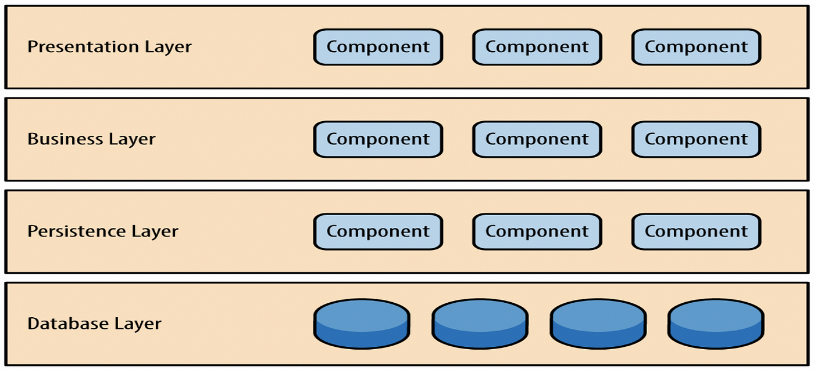
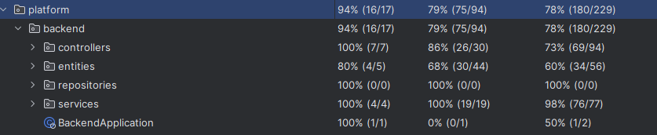

# Imperial Course Finder
## Introduction to this project

Undergraduate and Postgraduate students at Imperial are allowed to sign up for courses across college. Doing so is potentially particularly helpful for PhD students, who often are moving into a new area and would benefit from widening their expertise at the start of their research project. Unfortunately, however, there is currently no system that allows students to search efficiently for courses from across College. It is therefore very hard to know whether an appropriate course exists, and even harder to sign up.

The aim of this project outlined by Dr Ouldridge is to create a prototype platform which facilitates exploration of modules across all departments at Imperial College London.


## Setting up

1. Download Mysql and Workbench 8.0.
2. Clone the GitHub repository through

```git
https://github.com/RenzudadiZZA/IC_Course-finder.git
```

3. Create a local server with the username as root, password as software then create a schema:

```
CREATE SCHEMA `project_db` DEFAULT CHARACTER SET utf8mb4;
USE project_db;
```

4. Import the database either by running 'data/dbdump.sql' or create a schema based on the ERD and use your own module descriptors.

   ```
   backend/spring/src/main/resources/static/assets/ERD.png
   ```

5. Run the java file with the database running:

```
backend/spring/src/main/java/platform/backend/BackendApplication.java
```

6. Open localhost:8080 on web browser.

## Function introduction

Users are able to search for modules they want using keywords and module codes on the main page.

Some users might want to search by module content so we support users to search for terms in the module description, learning outcomes, etc.

Filters are necessary for a search platform and so users can filter modules by departments. (Since we only have a full database of Bioengineering modules, we manually inserted a number of mathematics, aeronautics and computing modules into our database to demonstrate this functionality. Filters won't show results for those departments which we haven't yet obtained module descriptors from.

Users are able to save their ideal modules to a list associated with their username for later review.

Users can get back to their previous search results by one click on the module info page.

Administrators might want to add or remove modules as they change over time, so it is possible to register as an admin user by inputing their Staff ID (This functionality has been emulated by entering 1111 as the username in the current version since we don't have access to staff data).

Our code supports seamless viewing on mobile phones and screens of all sizes.

## Project structure

All the backend java code is under

```
backend/spring/src/main/java/platform/backend
```

We use the **Layered Architecture pattern**, dividing the code into Controller, Service, Repository, and Entity layers. Benefits include clear separation of concerns, improved maintainability and testability, reduced coupling, and easier scalability. It allows the business logic (Service layer) to remain independent of data access (Repository layer), enhancing flexibility and modularity in the system design.



All the frontend codes are under

```
backend/spring/src/main/resources/static
```

Well classified and named to improve code organization.

## Code quality

First, we implemented ALL the functions discussed with Dr. Ouldridge!



We achieved 94% class coverage including 100% class coverage on controllers and services and 79% overall method coverage through Junit tests. Our Junit tests are designed to simulate some API post/get/delete responses and check if the apis return what is expected. We use assert true, assert equal, size of reply etc. to determine this.

Our code is well commented to ensure good legibility and coordination with other team members and future developers, we use descriptive words as class/file names  and variable names.

In terms of the frontend, we have a comprehensive error handling process and error messages for bug detection and user guidance.

We tried to reduce database burden by limiting user input and by applying optimizations on data storage, such as only storing the latest accessed data on the same module and only store 5 recent viewed courses on the database.

We used GitHub issues to ensure that all features were comprehensively implemented and use pull requests to avoid conflict on the main.

## Techniques we used

1. Database design and management: We use Mysql as database instead of Nosql, since it is a relatively small project (in terms of data volume).
2. Spring boot Framework to develop RESTful API to separate frontend and backend development.
3. We used HTML, CSS and javascript for frontend to achieve a dynamic UI and structured the frontend as different modules with the aim of improving maintainability.
4. The module descriptors were obtained using Python to automatically fetch them from the webapp given to us by the student office  and insert them into our database.

## Version control

We used github version control and created branches when developing. This improved our work efficiency and quality. The version v1.0.0 is the first version in which we implemented all the features required.(Search, filter, login, register, like, etc.) It is ostensibly fully functional. v1.1.0 is an optimized version in which we unified the frontend CSS files and made sure all the pages maintain a common style (Thank you Henry). This is also the first responsive version allowing users to comfortably browse modules on our platform across devices especially smartphones. v1.1.1 added some more Junit tests. v1.1.2 deleted back to list button on info page, this is the final version.

## Potential Improvement

Introduce caching to reduce database load for frequent queries, add multilingual support, improve test coverage, refactor redundant code, optimize URL parameter handling, encrypt user passwords and enhance SQL injection prevention with parameterized queries and ORM tools.
